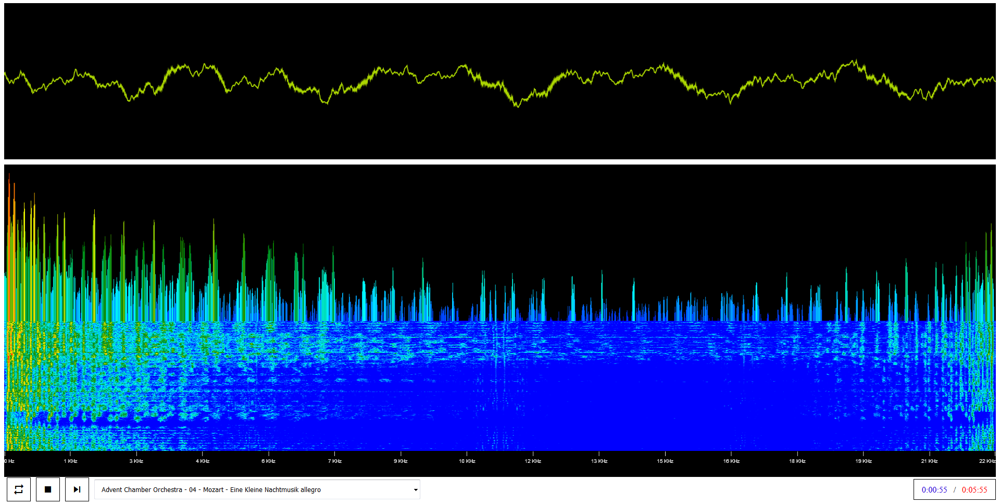

# Audio Visualizer
Display audio waveform (time domain), spectrum (frequency domain), and spectrogram (frequency domain over time) visualizations for the specified media (video/audio or audio).

## GitHub Pages
https://hyssopi.github.io/Audio-Visualizer/

## Prerequisites
(None)

## Build
(None)

## Run
Open `index.html` in a web browser.

## Test
(None)
